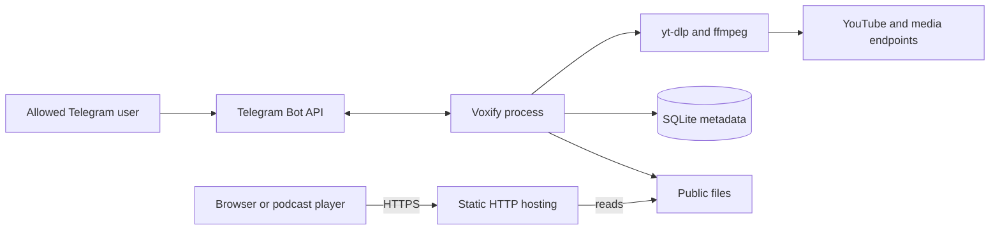
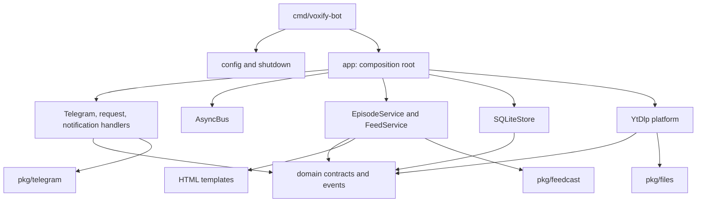
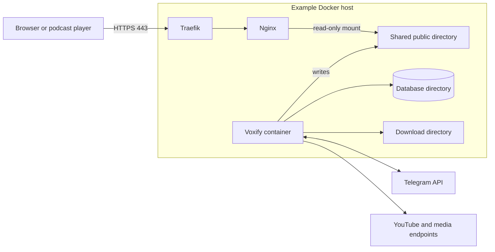

# Architecture and Operations

This document describes the current repository implementation for developers. It includes the working-tree landing-page and Makefile changes and does not claim that those changes are already deployed. Product scenarios and business rules are in [Product and System Analysis](analysis.md); installation examples are in the [README](../README.md).

## System context

Voxify is a Go application that receives Telegram messages, runs external media tools, stores metadata in SQLite, and generates static podcast artifacts. The binary does not serve HTTP. Public hosting is a separate responsibility.



Only bot interaction is restricted by Telegram user ID. RSS, landing HTML, audio, and images have no application-level access checks. The public host must provide any desired access policy. Sources: [application wiring](../internal/app/app.go), [authorization middleware](../internal/handlers/telegram.go), [Compose example](../docker-compose-example.yaml).

## Components and dependency direction



The diagram shows construction and source dependencies, not network services. Handlers invoke services through injected interfaces. The composition root supplies concrete services, store, platform, bus, and Telegram adapter. `domain` also aliases several feed types from `pkg/feedcast`, so it is not wholly independent of that package.

| Package | Responsibility |
| --- | --- |
| [`cmd/voxify-bot`](../cmd/voxify-bot/main.go), [`internal/app`](../internal/app/app.go) | Process entry, dependency assembly, startup, and shutdown. |
| [`internal/config`](../internal/config/config.go) | Typed environment configuration, defaults, and build version. |
| [`internal/domain`](../internal/domain/interfaces.go) | Episode/feed types, interfaces, requests, response statuses, events, and errors. |
| [`internal/handlers`](../internal/handlers/container.go) | Telegram dispatch, download admission/workers, build/info requests, replies, and request logging. |
| [`internal/events`](../internal/events/async-bus.go) | Concurrent in-process event dispatch with panic recovery and wait tracking. |
| [`internal/services`](../internal/services/container.go) | Episode validation/persistence/retention and RSS/HTML generation. |
| [`internal/platforms`](../internal/platforms/yt-dlp.go) | YouTube matching, external commands, metadata parsing, and media publication. |
| [`internal/store`](../internal/store/sqlite.go) | SQLite episode queries and transactions; embedded migrations. |
| [`internal/templates`](../internal/templates/init.go) | Landing HTML, feed-information HTML, and Telegram message formatting. |
| [`pkg/feedcast`](../pkg/feedcast/feed.go) | Feed construction and XML encoding. |
| [`pkg/telegram`](../pkg/telegram/adapter.go) | Adapter around the Telegram library, enabling interface-based tests. |
| [`pkg/files`](../pkg/files/move-file.go), [`pkg/randtoken`](../pkg/randtoken/token.go), [`pkg/shutdown`](../pkg/shutdown/context.go) | Filesystem operations, request IDs, and cancellation on signals. |

`pkg/cancelgroup` is a reusable utility with tests; application startup and request processing currently use their own context/wait-group handling instead.

### Internal contracts

These are Go interfaces, not remotely exposed APIs. Full signatures are in [domain/interfaces.go](../internal/domain/interfaces.go).

| Contract | Inputs and outputs | Implementation and boundary |
| --- | --- | --- |
| `EpisodeDownloader` | `Validate(ctx, DownloadRequest) error`; `Download(ctx, DownloadRequest) (*Episode, error)` | `EpisodeService`: checks input and duplicates, selects a platform, saves metadata, applies retention. |
| `Platform` | `ID()`, `Init(ctx)`, `Match(DownloadRequest)`, `Download(ctx, DownloadRequest)` | `YtDlp`: returns episode metadata after moving media into the public directory; does not insert the database row. |
| `FeedBuilder` | `Build(ctx) error`; `Info(ctx) (*FeedInfo, error)` | `FeedService`: reads retained episodes and creates publications, or derives feed information. |
| `Store` | Episode create/query/count/delete plus `Begin`, `Commit`, `Rollback`, `Close` | `SQLiteStore`: SQL transactions are available but do not cover publication or retention filesystem operations. |
| `EventBus` | `Publish(Event)`, `Subscribe(EventType, EventHandler)`, `Wait()` | `AsyncBus`: no durable delivery, acknowledgment, or retry interface. |

Requests carry a generated ten-character ID and Telegram source identifiers. The ID correlates logs, names output files, and is reused by the automatic build request. It is not a database job ID. Build request source is optional: `nil` distinguishes automatic builds from user requests. See [requests](../internal/domain/requests.go), [responses](../internal/domain/responses.go), and [events](../internal/domain/event.go).

## Lifecycle and processing

### Startup and shutdown

1. `main` creates the default `slog` logger, reads configuration, and creates a context canceled by `SIGINT`, `SIGTERM`, or `SIGQUIT`.
2. `App.init` parses templates, creates the event bus, opens SQLite, and migrates to the configured schema version (currently 1).
3. `EpisodeService.Init` checks yt-dlp and ffmpeg, checks directories, clears the download directory, and enforces retention. The two external-tool checks share a ten-second context.
4. `FeedService.Init` builds publications from remaining episodes.
5. The app constructs handlers and the Telegram adapter, registers subscriptions, starts download workers and waits for readiness, then registers bot handlers and notification subscriptions.
6. The bot starts receiving updates through the Telegram library in a goroutine. No webhook server is configured in the application.
7. On cancellation, the app waits for download workers and event handlers, then closes SQLite. It does not persist unfinished requests or explicitly join the bot goroutine. Outgoing replies use the same canceled context and may fail during shutdown.

Sources: [main](../cmd/voxify-bot/main.go), [app](../internal/app/app.go), [service container](../internal/services/container.go), [handler container](../internal/handlers/container.go), [signal handling](../pkg/shutdown/context.go).

### Download and publication flow

```mermaid
sequenceDiagram
    participant T as Telegram handler
    participant B as AsyncBus
    participant R as Request handlers and worker
    participant E as EpisodeService
    participant P as YtDlp platform
    participant D as SQLite and public files
    participant F as FeedService
    participant N as Notification handler
    T->>B: DownloadRequestEvent
    B-->>R: Dispatch in goroutine
    R->>E: Validate request
    E-->>R: Validation result
    alt Invalid, duplicate, or no worker ready
        R->>B: DownloadResponseEvent failed
        B-->>N: Send mapped error reply
    else Worker accepts request
        R->>B: DownloadResponseEvent pending
        B-->>N: Send started reply
        R->>E: Download with active URL guard
        E->>P: Download under timeout
        P->>P: Fetch metadata, thumbnail, and audio
        P->>D: Move thumbnail and audio to public directory
        P-->>E: Episode metadata
        E->>D: Insert episode, then enforce retention
        E-->>R: Episode or error
        alt Download service succeeds
            R->>B: DownloadResponseEvent success
            B-->>N: Send downloaded reply
            R->>B: BuildRequestEvent with no source
            B-->>R: Dispatch build handler
            R->>F: Build
            F->>D: Read episodes; replace HTML, then RSS
            F-->>R: Build result
            R->>B: BuildResponseEvent
            Note over B,N: Automatic build result is logged; no build reply
        else Download service fails
            R->>B: DownloadResponseEvent failed
            B-->>N: Send mapped error reply
        end
    end
```

The diagram expresses the logical flow, not a notification ordering guarantee. Bus subscribers run independently. A worker can advance while the pending response is still being dispatched.

The platform creates separate temporary directories for metadata, thumbnail, and audio, and defers their removal. Metadata comes from yt-dlp JSON. ffmpeg downloads/crops/scales available artwork to `<request ID>.jpg`; yt-dlp extracts audio to `<request ID>.<format>`. Metadata, artwork, and audio operations execute sequentially within a download. Platform calls use the configured download timeout; database insertion and retention use the parent context instead. The timeout therefore does not bound the entire request lifecycle.

Sources: [request handlers](../internal/handlers/request.go), [episode service](../internal/services/episode.go), [platform](../internal/platforms/yt-dlp.go), [notifications](../internal/handlers/notification.go).

### Concurrency and delivery

`AsyncBus.Publish` launches one goroutine per subscriber. Subscribers are held under a read/write mutex; a wait group tracks active invocations. Handler panics are recovered and logged. Recovery does not create a failed response or retry the operation.

The download worker channel is unbuffered. A nonblocking send admits work only when a worker can receive it. The active URL map uses `LoadOrStore` inside the worker to avoid concurrent downloads of the exact same URL. This is process-local coordination, not a database constraint or a persistent queue.

Build requests bypass the download worker channel. Multiple manual or automatic builds can execute concurrently; neither `FeedService` nor the bus serializes them. The configured worker count limits downloads, not all event-handler goroutines. Sources: [bus](../internal/events/async-bus.go), [request handlers](../internal/handlers/request.go).

## Persistence and publication boundaries

SQLite is opened using `modernc.org/sqlite`, with the connection pool limited to one open connection by application policy. This is a project choice, not a general claim that SQLite cannot support multiple connections. Embedded SQL migrations are applied using `golang-migrate`; foreign-key support is enabled. The migration defines the `episodes` table and three non-unique indexes. See [database initialization](../internal/store/db.go), [migration](../internal/store/migration/01_initial.up.sql), and the [field reference](analysis.md).

| Artifact | Location and lifetime |
| --- | --- |
| SQLite database | `DB_FILEPATH`; persistent source for episode metadata. |
| Temporary downloads | `DOWNLOAD_DIR/yt-dlp-*`; removed after platform work and cleared on service initialization. |
| Audio and artwork | `PUBLIC_DIR/<request ID>.<format>` and `.jpg`; retained until deletion policy removes them. |
| Landing page | `PUBLIC_DIR/index.html`; rebuilt on startup, `/build`, and successful downloads. |
| RSS | `PUBLIC_DIR/FEED_FILENAME`; rebuilt on the same triggers only when episodes exist. |

For each HTML/RSS output, `FeedService` creates a temporary file in the destination directory, writes and closes it, sets mode `0644`, and renames it over the destination. This provides replacement atomicity for each file separately. There is no paired HTML/RSS commit or explicit `fsync` durability step. HTML is replaced before RSS; a later RSS failure can leave different publication generations.

Media moves use `os.Rename`, with copy-and-remove fallback across filesystems. They do not use the same publication protocol as generated HTML/RSS. Database insertion happens after media moves. Retention deletes files before records, without a transaction spanning both resources. Sources: [feed publication](../internal/services/feed.go), [file moves](../pkg/files/move-file.go), [episode persistence and retention](../internal/services/episode.go).

### Confirmed limits and possible consequences

| Confirmed implementation fact | Possible consequence; not an observed production incident |
| --- | --- |
| No serialized feed builds or generation check | An older snapshot can finish last and replace newer output. |
| Separate HTML and RSS replacements | Readers can see mismatched publication generations. |
| No RSS write or removal when there are zero episodes | A previously generated RSS file can remain stale. |
| Thumbnail moves before audio; no general rollback in platform | A later move failure can leave orphaned artwork. |
| Cleanup after failed DB insertion is best effort | Published files can remain without a database row if cleanup also fails. |
| Retention deletes files before records and is not serialized across workers | Failures or overlapping retention passes can leave missing media references or inconsistent retention outcomes. |
| URL indexes are not unique and aliases are not normalized at admission | Concurrent aliases can produce duplicate content records. |
| Startup clears shared download storage; coordination is process-local | Multiple application instances sharing paths can interfere with each other's work. |

These are boundaries of the current design, not proposed new features. Related behavior is partially exercised by [episode service tests](../internal/services/episode_test.go) and [feed tests](../internal/services/feed_test.go); these tests do not establish crash recovery or multi-process safety.

## Configuration

Configuration is `config.Default()` overlaid by environment parsing. The binary does not read a dotenv file itself. `TELEGRAM_BOT_TOKEN` has an `unset` parsing tag. Required environment fields and defaults are defined by [config.go](../internal/config/config.go), [default.go](../internal/config/default.go), and [load.go](../internal/config/load.go).

| Variable | Application default / requirement |
| --- | --- |
| `TELEGRAM_BOT_TOKEN` | Required. |
| `TELEGRAM_ALLOWED_USERS` | Required; comma-separated integer IDs. |
| `PUBLIC_URL` | Required; base used to construct public feed/media URLs. |
| `DB_FILEPATH`, `PUBLIC_DIR`, `DOWNLOAD_DIR` | Required; no path defaults in `config.Default()`. |
| `DOWNLOAD_TIMEOUT` | `1h`. |
| `DOWNLOAD_FORMAT`, `DOWNLOAD_QUALITY` | `mp3`, `192k`. |
| `DOWNLOAD_WORKERS` | `2`. |
| `THUMBNAIL_SIZE` | `3000` pixels per side. |
| `YT_DLP_PATH`, `FFMPEG_PATH` | `yt-dlp`, `ffmpeg`. |
| `FEED_FILENAME`, `FEED_TITLE` | `rss.xml`, `Voxify Podcast`. |
| `FEED_DESC` | `This is a podcast feed generated by Voxify — https://github.com/ofstudio/voxify`. |
| `FEED_IMAGE` | `https://raw.githubusercontent.com/ofstudio/voxify/refs/heads/master/assets/voxify-cover-dark.png`. |
| `FEED_LANGUAGE`, `FEED_CATEGORIES` | `en`, `Technology`. |
| `FEED_CATEGORIES2`, `FEED_CATEGORIES3` | Empty; each nonempty list supplies a parent followed by subcategories. |
| `FEED_IS_EXPLICIT` | `false`. |
| `FEED_AUTHOR`, `FEED_KEYWORDS` | Empty. |
| `FEED_LINK` | `https://github.com/ofstudio/voxify`. |
| `FEED_MAX_EPISODES` | `0`; any value <= 0 disables retention. |

The paths shown in [.env-example](../.env-example) are example values, not Go defaults. The Docker image supplies `/data/db/voxify-bot.db`, `/data/public`, and `/data/downloads` through environment variables. `DB_DIR` and `DATA_DIR` are container setup settings, not parsed Go application fields. The database schema version is currently fixed at 1 in Go defaults, with no environment tag.

Configuration loading performs type parsing but no general range-validation pass. For example, zero or negative worker counts start no workers, so downloads cannot be admitted. Use a positive worker count and suitable positive timeout/thumbnail size. `FFMPEG_PATH` configures direct ffmpeg calls; the yt-dlp command does not receive `--ffmpeg-location`, so its own ffmpeg discovery must also work.

## Deployment and maintenance

### Reference topology



This is the [provided Compose example](../docker-compose-example.yaml), not evidence of production topology. Nginx mounts only public storage read-only. Traefik supplies HTTPS with certificate configuration placeholders. The bot makes outbound requests and exposes no application port.

The [Dockerfile](../Dockerfile) builds with Go 1.25, tests in the native builder stage, and cross-compiles a CGO-disabled binary. The Alpine runtime installs ffmpeg, Python, and a pinned yt-dlp release in a virtual environment. [entrypoint](../entrypoint) creates storage directories, recursively assigns ownership to `nobody`, sets directory mode `755`, then executes the process through `su-exec`. Recursive ownership changes are relevant when choosing bind mounts.

### Running and developing

For a direct run, install the Go version specified in [go.mod](../go.mod), yt-dlp, and ffmpeg; create writable database-parent/public/download directories; export the required environment variables. Example dotenv files must be explicitly loaded with exported variables before running `go run ./cmd/voxify-bot`.

The [Makefile](../Makefile) includes:

| Target | Purpose and operational effect |
| --- | --- |
| `test-race` | Run all Go tests five times with race detection. |
| `dev-local-run` | Export `.env.dev-local` values using the POSIX `.` command and run the bot. Loading errors stop the recipe before the bot starts. |
| `dev-local-clean` | Delete the specified local development database, downloads/public files, and the entire Docker development data directory. |
| `dev-docker-build` | Stop/remove the named development container, remove its image, and build a replacement. |
| `dev-docker-run` | Run the development image with an environment file and persistent bind-mounted data; remove the container on exit. |
| `mockery` | Delete generated mocks and regenerate them using [.mockery.yaml](../.mockery.yaml); requires an installed compatible mockery executable. |

`make -n <target>` inspects these recipes without executing their cleanup or runtime actions. No secrets from local environment files belong in documentation.

### Diagnosis and recovery

Logs use `slog` and include component prefixes, request IDs, URLs, Telegram source identifiers, and command error output. Follow a request ID from download through automatic build; download success alone is insufficient to diagnose publication. There are no built-in health or metrics endpoints.

| Symptom | Check and recovery |
| --- | --- |
| Startup fails | Check required exported configuration, writable paths, migration errors, and external-tool checks. Startup cleanup/retention may already have run before a later initialization failure. |
| Bot silently ignores a user | Verify `TELEGRAM_ALLOWED_USERS` and logged authorization decisions. |
| Busy reply | Retry later; there is no pending job to recover. |
| Download fails | Inspect command errors, source availability, format/quality, timeout, and ffmpeg discovery. |
| Downloaded episode missing from feed | Inspect build logs and public-file permissions; after correcting the cause, issue `/build` in Telegram. |
| Interrupted processing | Resubmit the URL after restart if no record exists. If it already exists, inspect publications and rebuild rather than assuming a new download is necessary. |
| Missing media after partial deletion | `/build` only regenerates metadata outputs; it cannot recreate audio or repair missing database content. Restore a consistent backup or investigate records/files manually. |

There is no backup command. For a consistent operational backup, stop the application and preserve both the database and retained public media, along with configuration stored securely. Restore them together, preserve file ownership, then start and verify generated publications. Startup applies the configured retention policy, so confirm that setting before restoring. Downloads are temporary storage, not recoverable jobs. This is an operational procedure derived from the storage boundaries, not an implemented backup subsystem.

### Commit organization and messages

Before creating commits, inspect the recent history with `git log --oneline` and follow the project's existing style. Use short English subjects beginning with a lowercase action verb, such as `fix`, `add`, `update`, or `document`. Preserve the spelling of identifiers and filenames, as in `update CHANGELOG for v1.1.4`. Do not introduce Conventional Commits prefixes unless the project adopts them explicitly.

Each commit must represent one logical change, grouped by domain behavior or component responsibility rather than by file count. Include the tests and documentation needed to understand and verify that change in the same commit. Split independent concerns into separate commits even when they are delivered in the same release; avoid splitting a single behavior change into incomplete intermediate commits.

For example, episode-card layout, development tooling, and a project-wide architecture reference are separate concerns. A related Makefile ignore rule belongs with the tooling change, while README navigation belongs with the documentation it introduces. Review each staged diff before committing. A release groups these commits; it is not a reason to squash them into one release-wide commit.

Finish the release series with a separate changelog commit using the existing style, such as `update CHANGELOG for v1.1.4`. Changelog entries summarize the user-facing changes selected for the release and need not list every maintenance commit.

### Build and release

By default, a release includes committing the release changes, creating a version tag, and pushing the release branches and tag to GitHub. Docker image verification is performed only when explicitly requested. Creating a GitHub Release and deploying the application are separate actions.

The release procedure is:

1. Prepare the changelog with the release date and comparison links; run the relevant checks, including `go test ./...` and `git diff --check`.
2. Fetch `origin`, confirm that the release tag is unused locally and remotely, and confirm that the branches can advance without rewriting history.
3. Commit the changes on `dev` as an ordered series of atomic commits following the organization and message rules above. Finish with `update CHANGELOG for vX.Y.Z`; do not combine independent changes into a single release commit.
4. Fast-forward `master` to the final commit in the series and return to `dev`.
5. Create a lightweight `vX.Y.Z` tag on that final commit, following the existing tag convention.
6. Push `dev`, `master`, and that tag to `origin` in one atomic push, without force, then verify the remote refs point to the final commit in the release series.

Pushing the tag triggers the existing image publication workflow. The default release task does not wait for or inspect Docker builds or images; perform that verification only when explicitly requested.

The [image workflow](../.github/workflows/image-build-push.yml) runs on pushed `v*.*.*` tags, builds `linux/amd64` and `linux/arm64` images, and pushes to GHCR. It passes the tag as `APP_VERSION`; the Dockerfile injects it through linker flags. Image metadata emits tag-based versions and a conditional `latest` tag. Inspect the workflow's condition before relying on `latest` promotion for a particular tag event. This workflow publishes images; it does not deploy a running instance.

## Verification map

| Area | Existing evidence | What it does not prove |
| --- | --- | --- |
| Handlers and notifications | [Telegram tests](../internal/handlers/telegram_test.go), [request tests](../internal/handlers/request_test.go), [notification tests](../internal/handlers/notification_test.go) with mocks | Real Telegram delivery, external API availability, or notification ordering in production. |
| Event bus | [AsyncBus tests](../internal/events/async-bus_test.go): subscription, dispatch, waiting, concurrency, panic handling | Durable delivery or cross-process coordination. |
| Episode behavior | [EpisodeService tests](../internal/services/episode_test.go): validation, mocked platforms, persistence failures, retention | Real yt-dlp/ffmpeg execution against YouTube. |
| Publication | [FeedService tests](../internal/services/feed_test.go): generated outputs, errors, empty feed, permissions | Atomicity across both output files, crash durability, or all concurrent build interleavings. |
| Database | [SQLite tests](../internal/store/sqlite_test.go) against migrated in-memory databases | Production backups, multi-instance safety, or filesystem failure recovery. |
| Presentation | [Landing tests](../internal/templates/landing_test.go), [helpers](../internal/templates/func_test.go), [messages](../internal/templates/messages_test.go) | Browser layout; the card CSS still needs browser viewport checks when changed. |
| RSS encoding | [feedcast tests](../pkg/feedcast/integration_test.go) and other package tests | Live acceptance by podcast directories or all podcast players. |

Useful repository commands:

```sh
go test ./...
go test ./internal/templates
make test-race
git diff --check
```

Run the appropriate checks for the change. Documentation-only edits need link/content review rather than live downloads or deployment. For card changes, check narrow and wide viewports, the 760 px column boundary, long URLs, long author names, and nonbreaking spaces. For documentation maintenance, compare defaults to Go configuration and Docker separately, trace scenario outcomes through error mapping, and keep diagrams consistent with operation order. Do not turn inferred limitations into measured incidents or describe unimplemented guarantees as current behavior.
